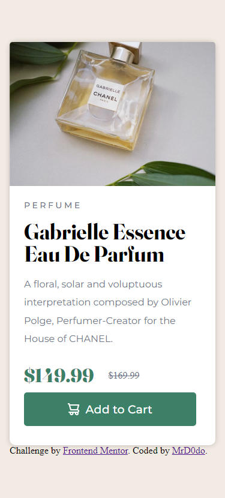

# Frontend Mentor - Product preview card component solution

This is my solution to the [Product preview card component challenge on Frontend Mentor](https://www.frontendmentor.io/challenges/product-preview-card-component-GO7UmttRfa).

## Table of contents

- [Overview](#overview)
  - [The challenge](#the-challenge)
  - [Screenshot](#screenshot)
  - [Links](#links)
- [My process](#my-process)
  - [Built with](#built-with)
  - [What I learned](#what-i-learned)
  - [Continued development](#continued-development)
  - [Useful resources](#useful-resources)
- [Author](#author)

## Overview

### The challenge

Users should be able to:

- View the optimal layout depending on their device's screen size
- See hover and focus states for interactive elements

### Screenshot

### Links

- Live Site URL: [Live Site URL](https://mrd0do.github.io/Frontend-Mentor/product-preview-card-component-main/)

## My process

### Built with

- Semantic HTML5 markup
- CSS custom properties
- CSS Grid
- CSS flexbox (inside the purchase button)

### What I learned

I set my goal for the challenge to make a preview card using CSS Grid. I've never used it before, so at the beginning, i found it a quite difficult to make, but after a little research on the internet, it was a bit easier to use the grid.

### Continued development

- I would like to get better my layouts (flexbox, grid)
- I would like to try the projects as simple as possible -> a better readability, SEO...
- someday I would like to try to learn CSS framework to make websites easier
etc...

### Useful resources

- [Learn CSS Grid - A 13 Minute Deep Dive by Slaying the Dragon](https://www.youtube.com/watch?v=EiNiSFIPIQE)
- [The HTML <picture> Element by W3Schools](https://www.w3schools.com/html/html_images_picture.asp)
- [CSS filter property by MDN](https://developer.mozilla.org/en-US/docs/Web/CSS/filter) - Image-hover state by changing the colors

## Author

- my Frontend Mentor account - [@MrD0do](https://www.frontendmentor.io/profile/MrD0do)
