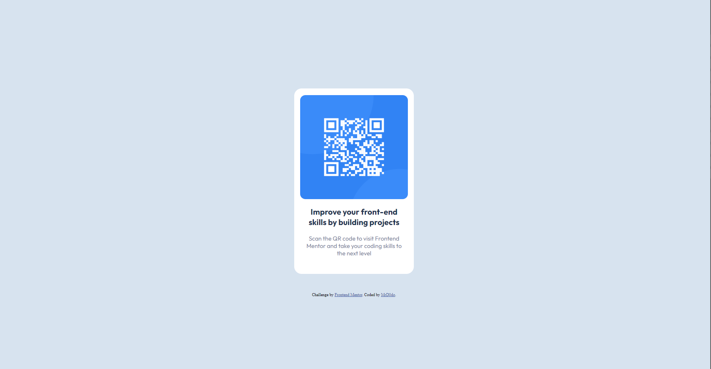

# Frontend Mentor - QR code component solution

This is a solution to the [QR code component challenge on Frontend Mentor](https://www.frontendmentor.io/challenges/qr-code-component-iux_sIO_H). Frontend Mentor challenges help you improve your coding skills by building realistic projects. 

## Table of contents

- [Overview](#overview)
  - [Screenshot](#screenshot)
  - [Links](#links)
- [My process](#my-process)
  - [Built with](#built-with)
  - [Useful resources](#useful-resources)
- [Author](#author)

## Overview
  
### Screenshot

### Links

- Live Site URL: [Live Site URL](https://MrD0do.github.io/Frontendmentor/qr-code-component)

## My process

### Built with

- Semantic HTML5 markup
- CSS custom properties
- Flexbox

### Useful resources

- [Flexbox Basics by Kevin Powell](https://youtu.be/hwbqquXww-U?list=PL4-IK0AVhVjMSb9c06AjRlTpvxL3otpUd)
- [Media Queries in under 5 minutes By Kevin Powell](https://youtu.be/2KL-z9A56SQ?list=PL4-IK0AVhVjP27yZLwW-gkPggRps0CCnP)

## Author

- Frontend Mentor - [My FrontendMentor Account](https://www.frontendmentor.io/profile/MrD0do)
