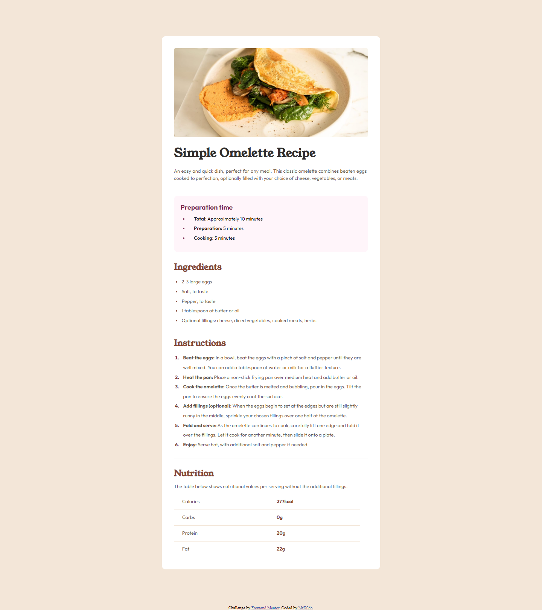

# Frontend Mentor - Recipe page solution

This is my solution to the [Recipe page challenge on Frontend Mentor](https://www.frontendmentor.io/challenges/recipe-page-KiTsR8QQKm).

## Table of contents

- [Overview](#overview)
  - [Screenshot](#screenshot)
  - [Links](#links)
- [My process](#my-process)
  - [Built with](#built-with)
  - [What I learned](#what-i-learned)
  - [Useful resources](#useful-resources)
- [Author](#author)

## Overview

### Screenshot

### Links

- Live Site URL: [Live Site URL](https://mrd0do.github.io/Frontend-Mentor/recipe-page-main/)

## My process

### Built with

- Semantic HTML5 markup
- CSS custom variables

### What I learned

I set my own goal to make this project without any grid or flexbox features. Although it was a bit hard (unnecessary much), i've completed the project, so i hope that it will work very well, especially on mobile devices...

### Useful resources

- I didn't search for any resources for it, i was trying to do that myself

## Author

- Frontend Mentor - [@MrD0do](https://www.frontendmentor.io/profile/MrD0do)

