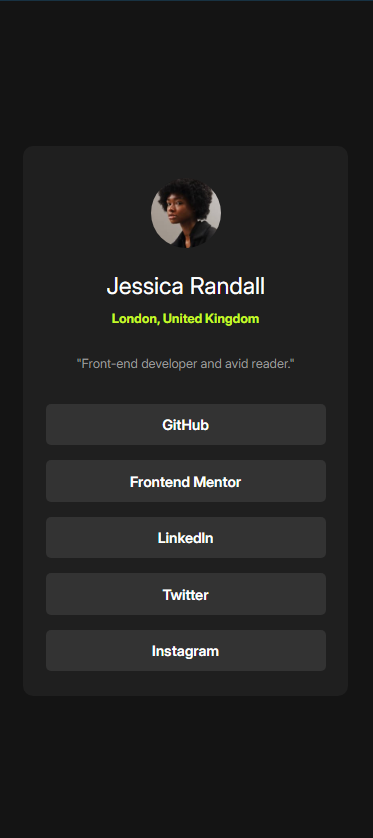
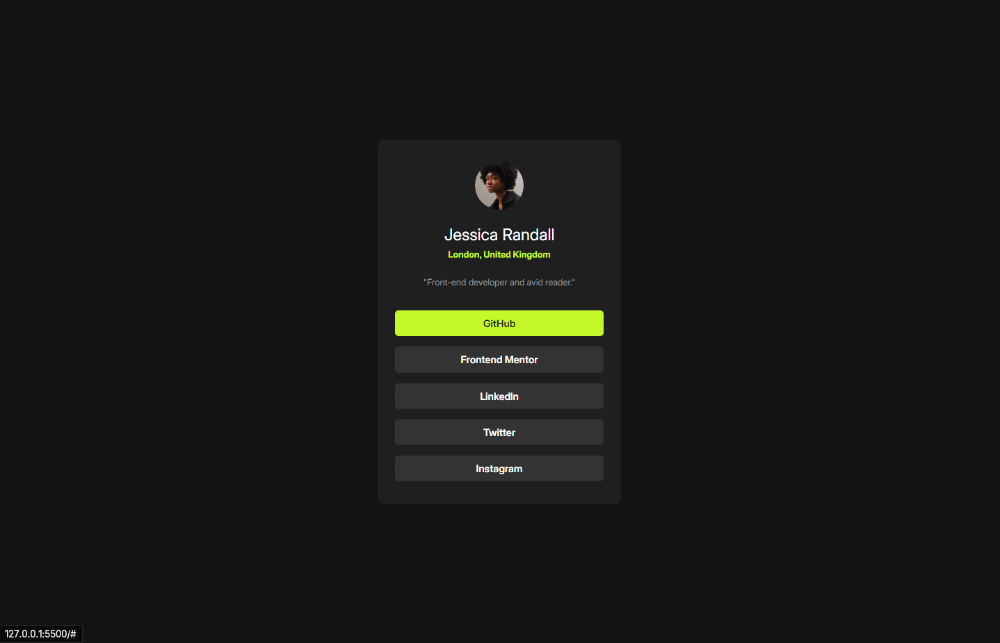

# Frontend Mentor - Social links profile solution

This is my solution to the [Social links profile challenge on Frontend Mentor](https://www.frontendmentor.io/challenges/social-links-profile-UG32l9m6dQ). 

## Table of contents

- [Overview](#overview)
  - [The challenge](#the-challenge)
  - [Screenshot](#screenshot)
  - [Links](#links)
- [My process](#my-process)
  - [Built with](#built-with)
  - [What I learned](#what-i-learned)
  - [Continued development](#continued-development)
  - [Useful resources](#useful-resources)
- [Author](#author)

## Overview

### The challenge

Users should be able to:

- See hover and focus states for all interactive elements on the page

### Screenshot

### Links

- Live Site URL: [Live Site URL](https://mrd0do.github.io/Frontend-Mentor/social-links-profile-main/)

## My process

### Built with

- Semantic HTML5 markup
- CSS custom properties
- Flexbox

### What I learned

- CSS custom variables
- bigger focus on the semantic HTML structure

### Continued development

- learn making the layout using css grid
- improve my semantic HTML structure (SEO)
- the try to build my discipline for my FE journey :D
- after completing a few projects -> learn some CSS framework or Javascript

### Useful resources

- [Semantic HTML5 elements explained by freecodecamp](https://www.freecodecamp.org/news/semantic-html5-elements/) 
- [HTML&CSS for absolute beginners - Semantic HTML by Kevin Powell](https://youtu.be/YOsMJQfwqow)
- [CSS custom variables article by MDN](https://developer.mozilla.org/en-US/docs/Web/CSS/CSS_cascading_variables/Using_CSS_custom_properties)

## Author

- my Frontend Mentor account - [@MrD0do](https://www.frontendmentor.io/profile/MrD0do)
